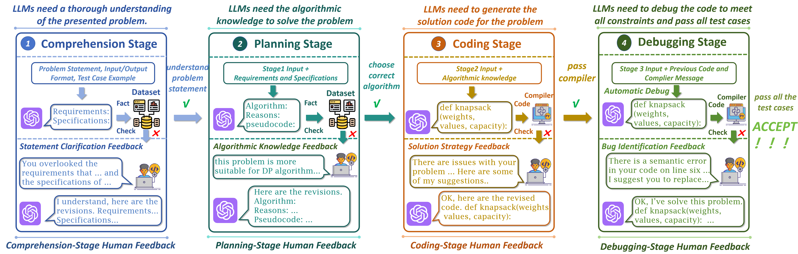
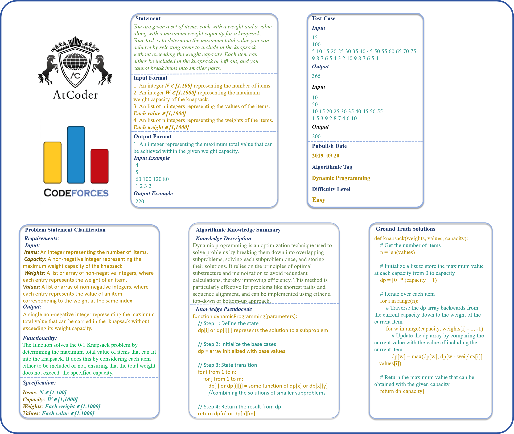

# ELABORATION

The paper "ELABORATION: A Comprehensive Benchmark on Human-LLM Competitive Programming" introduces the first systematic benchmark for evaluating interactive human-LLM collaboration in competitive programming. This complex task demands deep problem understanding, strategic planning, efficient coding under constraints, and careful debugging. While large language models (LLMs) have shown promise in supporting such tasks, existing human-LLM collaboration frameworks are often limited to specific stages and rely on fragmented feedback, hindering a holistic understanding of their synergy. To address this, the authors propose Elaboration, a benchmark featuring a comprehensive taxonomy of human feedback across the full programming workflow, along with a dataset for end-to-end evaluation. Results show that while LLMs struggle with difficult or unseen problems, incorporating high-quality human feedback—particularly during code generation—significantly enhances performance, offering a foundation for more effective human-LLM programming systems.
### Human Feedback Taxonomy

### Dataset Construction

