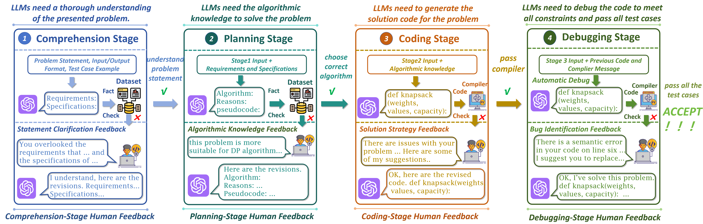
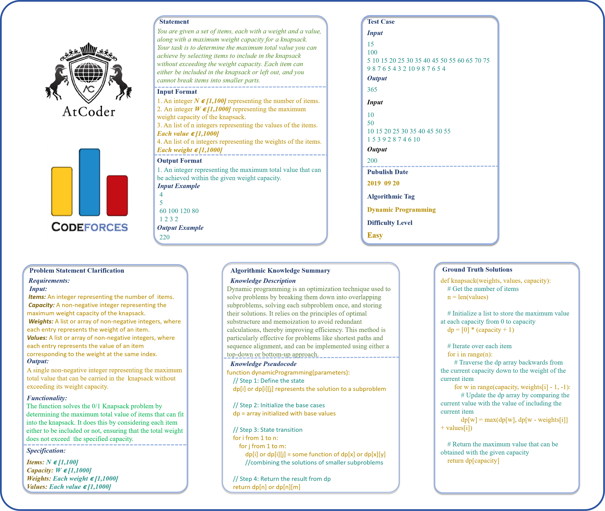

# ELABORATION: A Comprehensive Benchmark on Human-LLM Competitive Programming

> **ELABORATION** is the first systematic benchmark designed to evaluate **interactive human-LLM collaboration** in the domain of competitive programming.

## 📖 Overview

Competitive programming is a complex task demanding deep problem understanding, strategic planning, efficient coding under constraints, and careful debugging. While Large Language Models (LLMs) show promise, existing frameworks often limit collaboration to specific stages or rely on fragmented feedback.

To address this, we propose **ELABORATION**, a benchmark featuring:

* A **comprehensive taxonomy** of human feedback across the full programming workflow.
* A **dataset** designed for end-to-end evaluation of human-LLM synergy.

Our results demonstrate that while LLMs struggle with difficult or unseen problems, incorporating high-quality human feedback—particularly during code generation—significantly enhances performance.

---

## 🧠 Human Feedback Taxonomy

We introduce a structured taxonomy to categorize human feedback throughout the programming lifecycle. This allows for a granular analysis of how different types of human intervention impact LLM performance.

<div align="center">



<em>Figure 1: Taxonomy of Human Feedback in Competitive Programming Collaboration.</em>
</div>

---

## 📊 Dataset Construction

The ELABORATION dataset is constructed to support the end-to-end evaluation of interactive competitive programming. It includes diverse problem sets and interaction traces.

<div align="center">



<em>Figure 2: Overview of the Dataset Construction Process.</em>
</div>

---


## 🖊️ Citation

If you find our paper or dataset useful for your research, please cite us using the following BibTeX:

```bibtex
@article{yang2025elaboration,
  title={ELABORATION: A Comprehensive Benchmark on Human-LLM Competitive Programming},
  author={Yang, Xinwei and Liu, Zhaofeng and Huang, Chen and Zhang, Jiashuai and Zhang, Tong and Zhang, Yifan and Lei, Wenqiang},
  journal={arXiv preprint arXiv:2505.16667},
  year={2025}
}

```


